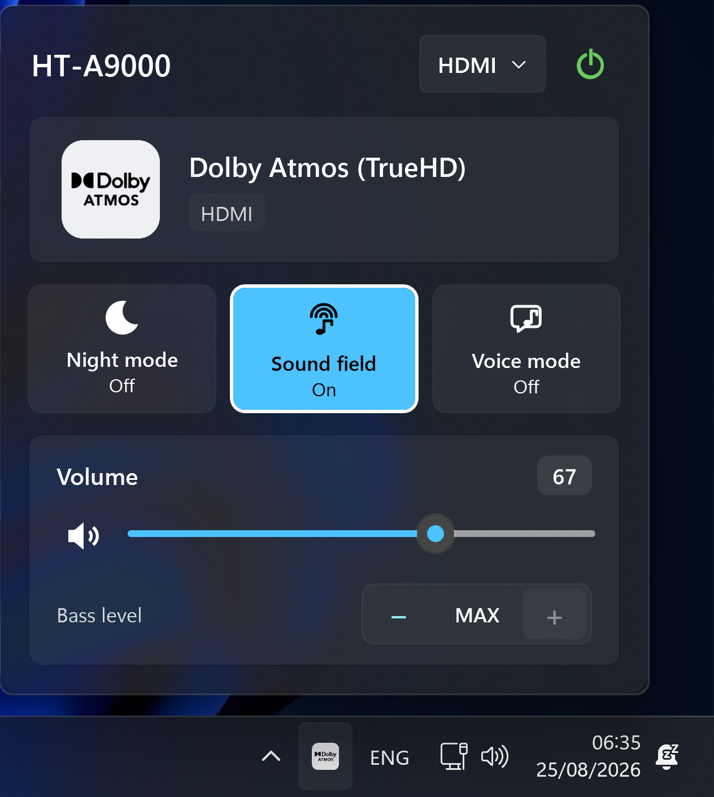
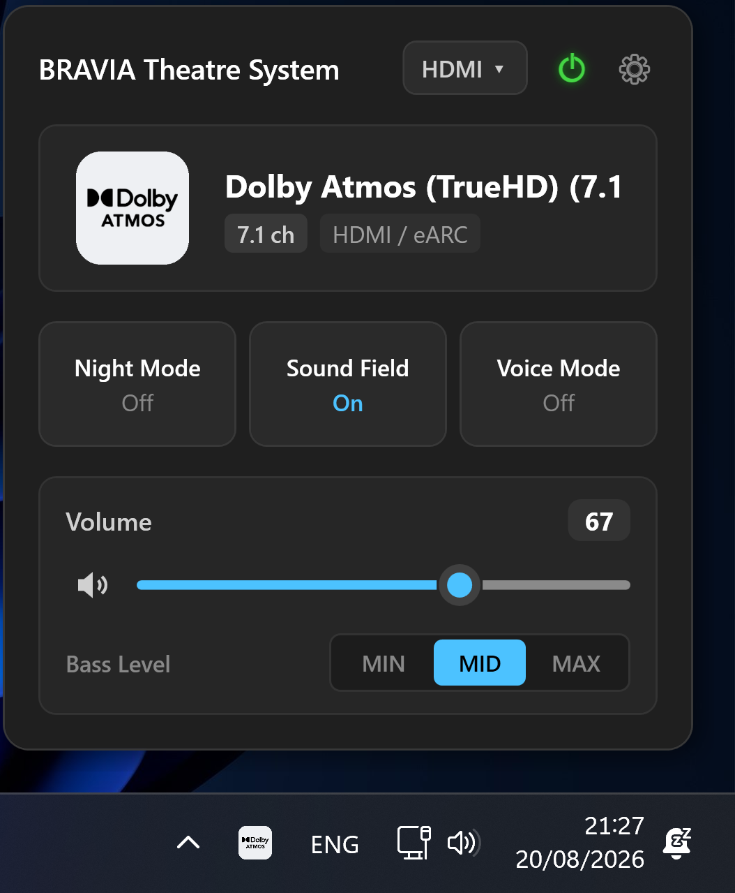
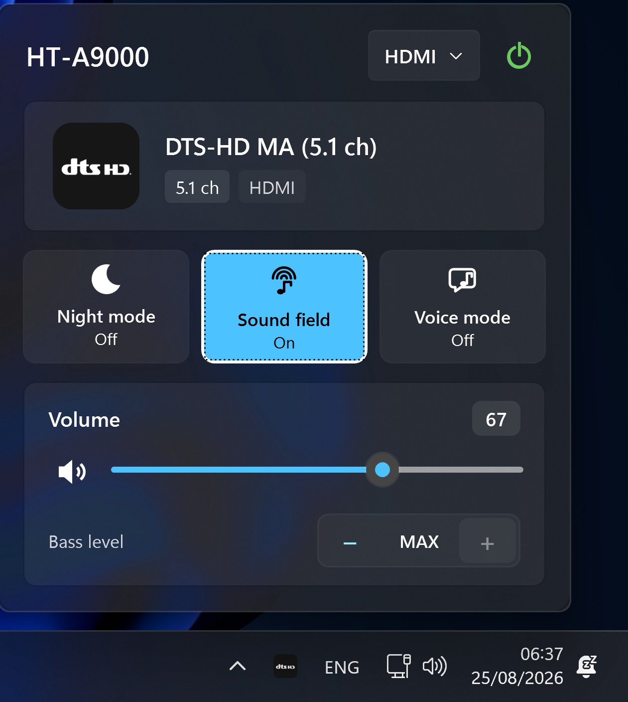

# BRAVIA Theatre PC (v2.0.0)

A high-performance, native Windows 11 system tray controller and Fluent Quick Settings flyout for modern Sony Home Audio systems, including the BRAVIA Theatre Bar 9 (HT-A9000), BRAVIA Theatre Bar 8 (HT-A8000), BRAVIA Theatre Quad (HT-A9M2), and compatible AV receivers.

Rewritten entirely from the ground up in C# and .NET 9 with Windows Presentation Foundation (WPF), BRAVIA Theatre PC v2.0.0 delivers real-time audio bitstream identification directly in the Windows taskbar, instantaneous zero-latency volume adjustments, bass level calibration, input switching, and quick toggles for 360 Spatial Sound Mapping (Sound Field), Night Mode, Voice Mode, and Power.

All communication occurs locally over Sony's encrypted gRPC protocol (port 55051), providing instantaneous response times without routing telemetry or control commands through external cloud servers during active playback.

---

## Screenshots

<div align="center">
  
  
  
</div>

<p align="center">
  <em>Live Windows 11 Fluent Quick Settings Flyout featuring dynamic audio bitstream detection, glowing power toggle, input source selection, compact action tiles, and native Windows sound slider.</em>
</p>

---

## Features

- **Dynamic Taskbar Codec Badges:** Real-time taskbar icon updates reflecting the active audio bitstream:
  - **Dolby Atmos:** TrueHD, Digital Plus (E-AC-3), and MAT containers
  - **Dolby Audio:** Dolby Digital Plus, Dolby TrueHD, and Dolby Digital (AC-3)
  - **DTS:** DTS:X, DTS:X Master Audio, DTS-HD Master Audio, DTS-HD High Resolution, DTS 96/24, and DTS Express
  - **IMAX Enhanced:** IMAX Enhanced DTS bitstreams
  - **Linear PCM:** Multichannel and stereo uncompressed LPCM
  - **Sony 360 Reality Audio & AAC**
  - **Standby & Idle Indicators**
- **Windows 11 Fluent Quick Settings Flyout:**
  - **Header Controls:** Interactive input source switcher (`HDMI ▾`, `TV ▾`, `BLUETOOTH ▾`), glowing power symbol (`⏻`), and Settings gear (`⚙`).
  - **Sony App-Aligned Quick Action Tiles:** Instant toggle buttons for **Night Mode**, **Sound Field** (360 Spatial Sound Mapping), and **Voice Mode**.
  - **Native Windows 11 Sound Slider & Mute Icon:** Custom halo thumb, Fluent Blue fill (`#4CC2FF`), click-to-point track jumping, mouse-wheel scrolling, and Windows speaker/mute icon (`Speaker + X`).
  - **3-Way Bass Level Selector:** Compact segmented pill control (`MIN` | `MID` | `MAX`) for instant subwoofer level calibration.
  - **Optional Rear Speaker Level Slider:** Smooth `-10` to `+10` level slider for systems paired with SA-RS3S or SA-RS5 surround speakers.
  - **Active Audio Hero Card:** Detailed bitstream format, audio channel layout (e.g., 7.1, 5.1.2, 2.0), and physical input source (eARC / HDMI).
  - **Ergonomic Bottom-Anchored Layout:** Volume slider positioned closest to the taskbar for immediate reach.
- **Configurable Global Keyboard Shortcuts:**
  - `Ctrl + Alt + Up`: Volume Up (+2)
  - `Ctrl + Alt + Down`: Volume Down (-2)
  - `Ctrl + Shift + M`: Toggle Mute
  - `Ctrl + Alt + S`: Toggle Sound Field
  - `Ctrl + Alt + V`: Toggle Voice Mode
  - `Ctrl + Alt + N`: Toggle Night Mode
  - *(All shortcuts are interactively customizable in the Settings window)*
- **Dedicated Fluent Settings Window:** Windows 11 Fluent dialog for startup configuration, taskbar icon persistence, optional rear speaker level slider, and interactive global shortcut customization with live key recording.
- **High-Performance Non-Blocking Architecture:**
  - Background asynchronous command queuing with volume coalescing to prevent network bottlenecking during rapid slider movement.
  - Pure Win32 `Shell_NotifyIconW` integration with automatic explorer recovery upon `TaskbarCreated` messages.
- **Local Network Auto-Discovery:**
  - Multi-interface mDNS discovery (`_sonysmarthome._tcp.local.`) coupled with parallel subnet TCP probing on port `55051`, finding devices in ~120ms.
- **Built-in First-Time Setup Wizard:** Native graphical OAuth PKCE setup dialog that guides users step-by-step through Sony account authentication without manual command-line execution.

---

## Supported Devices

- Sony BRAVIA Theatre Bar 9 (HT-A9000)
- Sony BRAVIA Theatre Bar 8 (HT-A8000)
- Sony BRAVIA Theatre Quad (HT-A9M2)
- Compatible Sony Home Audio systems and AV receivers utilizing the Sony BRAVIA Connect protocol

---

## Getting Started

### Prerequisites

- Windows 10 (version 1903 or later) / Windows 11 (64-bit)
- [.NET 9.0 SDK](https://dotnet.microsoft.com/download/dotnet/9.0) (if building from source)

### Installation & Execution

#### Option 1: Standalone Single-File Executable (Recommended)

1. Download **`BraviaTheatrePC.exe`** (~61 MB) from the latest [GitHub Releases](../../releases) page.
2. Place the executable in any directory of your choice and run it (zero dependencies, no .NET installation required).
3. On first launch, the **Sony Account Setup** wizard will open automatically to guide you through setup.

#### Option 2: Ultra-Compact Lightweight Executable (3.5 MB)

1. Download **`BraviaTheatrePC-FrameworkDependent.exe`** (3.5 MB) from [GitHub Releases](../../releases).
2. Requires [.NET 9 Desktop Runtime](https://dotnet.microsoft.com/download/dotnet/9.0) installed on your system.

#### Option 3: Running from Source

1. Clone the repository:
   ```bat
   git clone https://github.com/pyed/bravia-theatre-pc.git
   cd bravia-theatre-pc
   ```

2. Run the application:
   ```bat
   dotnet run --project src/BraviaTheatre.UI/BraviaTheatre.UI.csproj
   ```

#### Option 4: Building Standalone Executable Locally

To produce the self-contained single-file executable locally:

```bat
dotnet publish src/BraviaTheatre.UI/BraviaTheatre.UI.csproj -c Release -r win-x64 --self-contained -p:PublishSingleFile=true -p:EnableCompressionInSingleFile=true -p:DebugType=none -o publish
```

---

## First-Time Sony Account Setup

Sony BRAVIA Theatre devices derive local gRPC encryption keys from Sony Cloud OAuth sessions. The application features an integrated setup wizard with **automatic sign-in** and a manual fallback.

### Automatic Sign-In (Recommended):

1. Launch `BraviaTheatrePC.exe`.
2. The **Sony Account Sign-In** window will appear with the official Sony login page.
3. Log in with your Sony account (the same account linked to your soundbar in the Sony BRAVIA Connect mobile app).
4. The application **automatically intercepts** the sign-in callback, exchanges cryptographic keys, and connects immediately to your soundbar — no Developer Tools or copy-pasting required!

### Manual Sign-In (Fallback / Developer Tools):

If your account uses a third-party social provider or you prefer manual setup:
1. Click **Switch to Manual Mode (F12)** at the bottom of the sign-in window.
2. Click **Open Sony Sign-In in Browser**.
3. In your browser, press `F12` (or right-click -> Inspect) to open Developer Tools and enable **Preserve log** in the **Network** tab.
4. Log into Sony and locate the redirect request starting with:
   ```
   ssh-app://signin?code=...
   ```
5. Copy and paste the redirect URL into the setup dialog and click **Complete & Connect**.

> **Security Note:** `session_keys.json` contains encrypted session keys stored strictly on your local machine (`%APPDATA%\BraviaTheatrePC\`). It is excluded from version control via `.gitignore` and should never be shared publicly.

---

## Controls & Usage

- **Left-Click Tray Icon:** Opens the Windows 11 Fluent Quick Settings flyout panel.
- **Mouse Wheel on Volume Card:** Adjusts soundbar master volume in 1-tick increments.
- **Click Speaker Icon:** Toggles mute with Windows mute icon indicator.
- **Right-Click Tray Icon:** Opens the context menu:
  - **Header Status:** Live soundbar power, bitstream format, and volume level.
  - **Settings:** Opens the Settings dialog.
  - **Sony Account Setup:** Re-authenticate or switch Sony accounts.
  - **Exit:** Shut down the application.

---

## Configuration

An optional `config.json` file can be placed alongside `BraviaTheatrePC.exe` to specify connection parameters:

```json
{
  "host": "192.168.1.118",
  "port": 55051
}
```

- `host`: Static IPv4 address of the soundbar (leave empty for automatic mDNS / subnet discovery).
- `port`: The gRPC control port (default: `55051`).

---

## Architecture & Codebase Structure

```
bravia-theatre-pc/
├── src/
│   ├── BraviaTheatre.Core/              # Core protocol library (.NET 9)
│   │   ├── Auth/                        # Sony Seeds OAuth PKCE generator & REST client
│   │   ├── Discovery/                   # Multi-interface mDNS listener + subnet scanner
│   │   ├── Engine/                      # Non-blocking gRPC client & command queue engine
│   │   ├── Models/                      # State models & codec classification taxonomy
│   │   ├── Protos/                      # Sony gRPC ControlDevice service protobuf definitions
│   │   └── Wire/                        # Bit-for-bit protobuf wire codecs & HMAC signing
│   └── BraviaTheatre.UI/                # Native Windows 11 WPF application
│       ├── Models/                      # AppSettings model
│       ├── Services/                    # Native Win32 tray wrapper (Shell_NotifyIconW) & Global Hotkeys
│       └── Views/                       # Windows 11 Fluent Flyout, Settings Dialog, & Setup Wizard
└── tests/
    └── BraviaTheatre.Tests/             # Automated xUnit wire codec test suite
```

---

## Running Automated Tests

To execute the unit test suite covering wire serialization, HMAC token generation, and codec mapping:

```bat
dotnet test
```

---

## Acknowledgments

Special thanks to **Ryan Ludwig** ([@steamEngineer](https://github.com/steamEngineer)) for his reverse engineering work and development of the [`pybravia-connect`](https://github.com/steamEngineer/pybravia-connect) library, which served as the reference foundation for Sony's encrypted local audio control protocol.

---

## Disclaimer

This is an independent, open-source project and is not affiliated with, sponsored by, or endorsed by Sony Corporation. Sony, BRAVIA, BRAVIA Theatre, 360 Spatial Sound Mapping, Dolby, Dolby Atmos, Dolby Audio, DTS, and DTS:X are trademarks of their respective owners.
