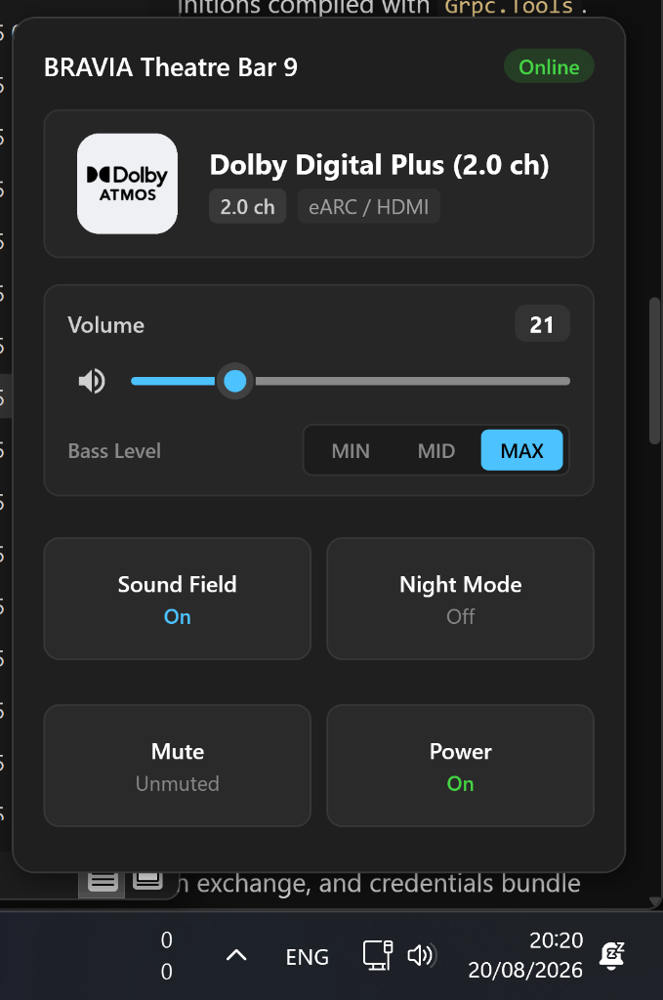
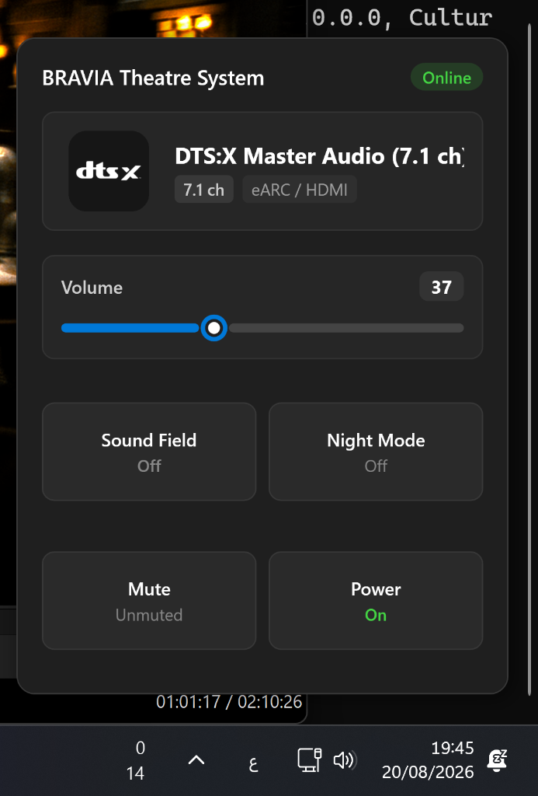

# BRAVIA Theatre PC

A high-performance, native Windows 11 system tray controller and Fluent Quick Settings flyout for modern Sony Home Audio systems, including the BRAVIA Theatre Bar 9 (HT-A9000), BRAVIA Theatre Bar 8 (HT-A8000), BRAVIA Theatre Quad (HT-A9M2), and compatible AV receivers.

Built natively in C# and .NET 9 with Windows Presentation Foundation (WPF), BRAVIA Theatre PC delivers real-time audio bitstream identification directly in the Windows taskbar, instantaneous zero-latency volume adjustments, bass level calibration, and quick toggles for 360 Spatial Sound Mapping, Night Mode, Mute, and Power.

All communication occurs locally over Sony's encrypted gRPC protocol (port 55051), providing instantaneous response times without routing telemetry or control commands through external cloud servers during active playback.

---

## Screenshots

<div align="center">
  
  
  
</div>

---

## Features

- **Dynamic Taskbar Codec Badges:** Real-time taskbar icon updates reflecting the active audio bitstream:
  - **Dolby Atmos:** TrueHD, Digital Plus (E-AC-3), and MAT containers
  - **Dolby Audio:** Dolby Digital Plus, Dolby TrueHD, and Dolby Digital (AC-3)
  - **DTS:** DTS:X, DTS:X Master Audio, DTS-HD Master Audio, DTS-HD High Resolution, DTS 96/24, and DTS Express
  - **IMAX Enhanced:** IMAX Enhanced DTS bitstreams
  - **Linear PCM:** Multichannel and stereo uncompressed LPCM
  - **Sony 360 Reality Audio & AAC**
  - **Standby & Idle Indicators**
- **Windows 11 Fluent Quick Settings Flyout:**
  - **Native Windows 11 Sound Slider:** Custom halo thumb, Fluent Blue fill (`#4CC2FF`), click-to-point track jumping, and mouse-wheel scrolling.
  - **3-Way Bass Level Selector:** Compact segmented pill control (`MIN` | `MID` | `MAX`) for instant subwoofer level calibration.
  - **Active Audio Hero Card:** Detailed bitstream format, audio channel layout (e.g., 7.1, 5.1.2, 2.0), and physical input source (eARC / HDMI).
  - **Quick Action Tiles:** Toggle 360 Spatial Sound Mapping (Sound Field), Night Mode, Power, and Mute with instant visual feedback.
  - **Adaptive Tray Positioning:** Automatic alignment above the Windows taskbar with smooth click-away dismissal.
- **High-Performance Non-Blocking Architecture:**
  - Background asynchronous command queuing with volume coalescing to prevent network bottlenecking during rapid slider movement.
  - Pure Win32 `Shell_NotifyIconW` integration with automatic explorer recovery upon `TaskbarCreated` messages.
- **Local Network Auto-Discovery:**
  - Multi-interface mDNS discovery (`_sonysmarthome._tcp.local.`) coupled with parallel subnet TCP probing on port `55051`, finding devices in ~130ms.
- **Built-in First-Time Setup Wizard:** Native graphical OAuth PKCE setup dialog that guides users step-by-step through Sony account authentication without manual command-line execution.

---

## Supported Devices

- Sony BRAVIA Theatre Bar 9 (HT-A9000)
- Sony BRAVIA Theatre Bar 8 (HT-A8000)
- Sony BRAVIA Theatre Quad (HT-A9M2)
- Compatible Sony Home Audio systems and AV receivers utilizing the Sony BRAVIA Connect protocol

---

## Getting Started

### Prerequisites

- Windows 10 (version 1903 or later) / Windows 11 (64-bit)
- [.NET 9.0 SDK](https://dotnet.microsoft.com/download/dotnet/9.0) (if building from source)

### Installation & Execution

#### Option 1: Running from Source

1. Clone the repository:
   ```bat
   git clone https://github.com/pyed/bravia-theatre-pc.git
   cd bravia-theatre-pc
   ```

2. Run the application:
   ```bat
   dotnet run --project src/BraviaTheatre.UI/BraviaTheatre.UI.csproj
   ```

#### Option 2: Publishing Standalone Single-File Executable

To produce a self-contained single-file executable requiring no external .NET runtime on the host machine:

```bat
dotnet publish src/BraviaTheatre.UI/BraviaTheatre.UI.csproj -c Release -r win-x64 --self-contained -p:PublishSingleFile=true -p:EnableCompressionInSingleFile=true -p:DebugType=none -o publish
```

The compiled binary `publish/BraviaTheatrePC.exe` can be placed anywhere on your system.

---

## First-Time Sony Account Setup

Sony BRAVIA Theatre devices derive local gRPC encryption keys from Sony Cloud OAuth sessions. The application includes a graphical setup wizard to generate your local `session_keys.json` credentials bundle.

### Step-by-Step Authentication Guide:

1. Launch `BraviaTheatrePC.exe`.
2. When prompted by the setup wizard, click **Open Sony Sign-In in Browser**.
3. In the browser window that opens, press `F12` (or right-click and select **Inspect**) to open **Developer Tools**.
4. In Developer Tools, navigate to the **Network** tab and ensure **Preserve log** is enabled.
5. Log into your Sony account (the same account linked to your soundbar in the Sony BRAVIA Connect mobile application).
6. Filter network requests by typing `signin` or `ssh`.
7. Locate the redirect request starting with:
   ```
   ssh-app://signin?code=...
   ```
8. Copy the entire URL (or the authorization code value) and paste it into the setup dialog.
9. Click **Complete & Connect**. The application will exchange tokens, query the soundbar on your local network, and save your credentials to `session_keys.json`.

> **Security Note:** `session_keys.json` contains encrypted session keys stored strictly on your local machine. It is excluded from version control via `.gitignore` and should never be shared publicly.

---

## Controls & Usage

- **Left-Click Tray Icon:** Opens the Windows 11 Fluent Quick Settings flyout panel.
- **Mouse Wheel on Volume Card:** Adjusts soundbar master volume in 1-tick increments.
- **Right-Click Tray Icon:** Opens the context menu:
  - **Header Status:** Live soundbar power, bitstream format, and volume level.
  - **Start with Windows:** Toggle automatic launch on Windows logon via the registry.
  - **Always show on taskbar:** Pin icon next to the system clock.
  - **Sony Account Setup:** Re-authenticate or switch Sony accounts.
  - **Exit:** Shut down the application.

---

## Configuration

An optional `config.json` file can be placed alongside `BraviaTheatrePC.exe` to specify connection parameters:

```json
{
  "host": "192.168.1.118",
  "port": 55051
}
```

- `host`: Static IPv4 address of the soundbar (leave empty for automatic mDNS / subnet discovery).
- `port`: The gRPC control port (default: `55051`).

---

## Architecture & Codebase Structure

```
bravia-theatre-pc/
├── src/
│   ├── BraviaTheatre.Core/              # Core protocol library (.NET 9)
│   │   ├── Auth/                        # Sony Seeds OAuth PKCE generator & REST client
│   │   ├── Discovery/                   # Multi-interface mDNS listener + subnet scanner
│   │   ├── Engine/                      # Non-blocking gRPC client & command queue engine
│   │   ├── Models/                      # State models & codec classification taxonomy
│   │   ├── Protos/                      # Sony gRPC ControlDevice service protobuf definitions
│   │   └── Wire/                        # Bit-for-bit protobuf wire codecs & HMAC signing
│   └── BraviaTheatre.UI/                # Native Windows 11 WPF application
│       ├── Services/                    # Native Win32 tray wrapper (Shell_NotifyIconW)
│       └── Views/                       # Windows 11 Fluent Flyout & OAuth Setup Wizard
└── tests/
    └── BraviaTheatre.Tests/             # Automated xUnit wire codec test suite
```

---

## Running Automated Tests

To execute the unit test suite covering wire serialization, HMAC token generation, and codec mapping:

```bat
dotnet test
```

---

## Acknowledgments

Special thanks to **Ryan Ludwig** ([@steamEngineer](https://github.com/steamEngineer)) for his reverse engineering work and development of the [`pybravia-connect`](https://github.com/steamEngineer/pybravia-connect) library, which served as the reference foundation for Sony's encrypted local audio control protocol.

---

## Disclaimer

This is an independent, open-source project and is not affiliated with, sponsored by, or endorsed by Sony Corporation. Sony, BRAVIA, BRAVIA Theatre, 360 Spatial Sound Mapping, Dolby, Dolby Atmos, Dolby Audio, DTS, and DTS:X are trademarks of their respective owners.
