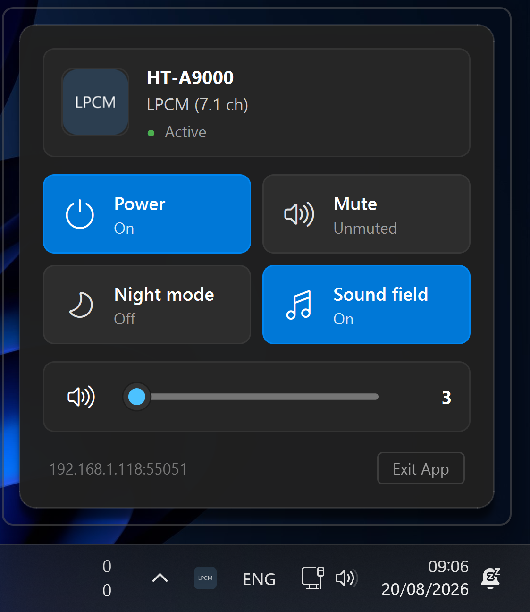
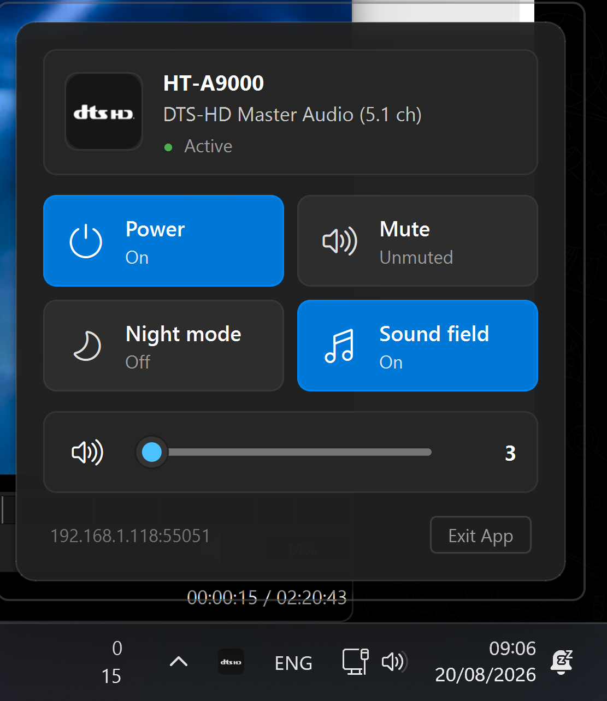
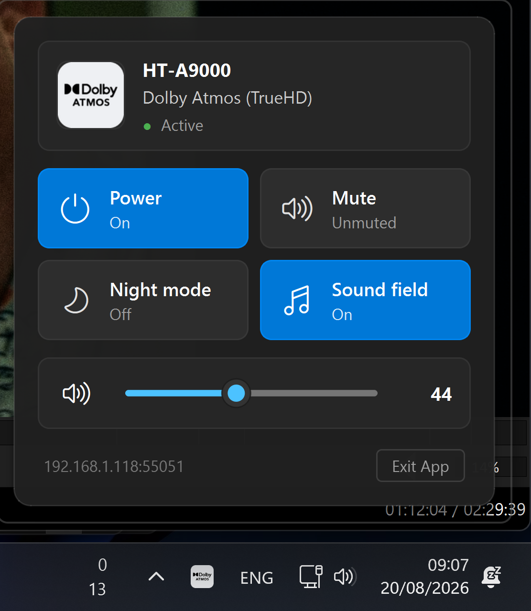

# BRAVIA Theatre PC

A native-feeling Windows 11 **system tray** and **Fluent Quick Settings Flyout** application for 2024+ Sony Home Audio systems (BRAVIA Theatre Bar 9 / **HT-A9000**, BRAVIA Theatre Bar 8 / HT-A8000, BRAVIA Theatre Quad / HT-A9M2, and compatible AV receivers).

Features a **live audio codec badge** in the Windows notification area, a **Windows 11 Quick Settings Flyout panel** with an **interactive Fluent volume slider**, **audio codec hero card**, **built-in Sony Account Setup wizard**, **Windows Auto-Start**, and **quick action tiles** (Power, Mute, Night Mode, Sound Field) — communicating securely over Sony's local encrypted gRPC protocol (port **55051**) with zero legacy TCP sockets.

> **Tested on:** Sony BRAVIA Theatre Bar 9 (HT-A9000) · Windows 10/11 · Standalone `.exe` & Python 3.10+

---

## 📸 Screenshots

<div align="center">
  
  
  
</div>

---

## How it works

```
┌──────────────────────────────────────────────────────────────┐
│  System Tray Icon (Notification Area)                        │
│  • Left Click: Opens Windows 11 Quick Controls Flyout        │
│  • Right Click: Quick Context Menu & Auto-Start with Windows │
│  • Live Codec Icon (ATMOS, DTS:X, LPCM, IMAX, etc.)          │
└──────────────────────────────┬───────────────────────────────┘
                               │ UI Interaction
                               ▼
┌──────────────────────────────────────────────────────────────┐
│  PySide6 Windows 11 Fluent Flyout Panel                      │
│  • Codec Hero Card (Brand Badge, Device Name, Audio Channels)│
│  • Quick Action Tiles (Power, Mute, Night Mode, Sound Field) │
│  • Fluent Volume Slider (Real-time drag, Halo thumb, Numbers)│
│  • Auto-docking above taskbar & click-away auto-dismissal    │
└──────────────────────────────┬───────────────────────────────┘
                               │ Thread-safe State & Commands
                               ▼
┌──────────────────────────────────────────────────────────────┐
│  bravia-engine (Daemon Thread)                               │
│  • Single pybravia-connect client on Port 55051              │
│  • Live notify wiretap + command queue with deduplication    │
└──────────────────────────────────────────────────────────────┘
```

* **Live Codec Badges:** Tray icon dynamically updates in real time to match the active audio bitstream:

  | Codec Family | Included Formats | Visual Identity | Master Asset |
  |---|---|---|---|
  | **Dolby Atmos** | Dolby Atmos (TrueHD / MAT / DD+) | Sony App Light Card + Black `[D D] Dolby ATMOS` | `assets/icons/atmos.png` |
  | **Dolby TrueHD** | Dolby TrueHD (Lossless) | Sony App Light Card + Black `[D D] Dolby ATMOS` | `assets/icons/truehd.png` |
  | **Dolby Digital+** | Dolby Digital Plus & Dolby MAT | Sony App Light Card + Black `[D D] Dolby ATMOS` | `assets/icons/ddplus.png` |
  | **Dolby Digital** | Standard Dolby Digital (AC-3) | Sony App Light Card + Black `[D D] Dolby ATMOS` | `assets/icons/dd.png` |
  | **DTS:X** | DTS:X & DTS:X Master Audio | Dark Graphite + Official White `dtsx` | `assets/icons/dtsx.png` |
  | **DTS-HD** | DTS-HD Master Audio & High Resolution | Dark Graphite + Official White `dts-HD` | `assets/icons/dtshd.png` |
  | **DTS** | DTS 96/24, DTS-ES, DTS Express | Dark Graphite + Official White `dts` | `assets/icons/dts.png` |
  | **IMAX Enhanced** | IMAX Enhanced DTS / DTS:X | Electric Blue + Official White `IMAX` | `assets/icons/imax.png` |
  | **LPCM** | Linear PCM & Multichannel PCM | Studio Slate + Crisp Bold `LPCM` | `assets/icons/lpcm.png` |
  | **AAC** | MPEG-2 AAC & MPEG-4 AAC | Slate Blue + Crisp Bold `AAC` | `assets/icons/aac.png` |
  | **360RA** | Sony 360 Reality Audio | Sony Teal + Crisp Bold `360RA` | `assets/icons/360ra.png` |
  | **Idle / Standby** | Inactive / Standby / Unknown | Matte Black + Subtle Silver `BRAVIA` | `assets/icons/idle.png` |

---

## 🚀 Quick Start (Standalone Executable)

1. Download **`BraviaTheatrePC.exe`** from [Releases](../../releases).
2. Double-click to launch (no Python installation required).
3. On first launch, the built-in **Sony Account Setup Wizard** will open:
   - Click **Open Sony Sign-In in Browser** and log in with your Sony account.
   - Follow the step-by-step developer tools guide in the wizard to paste the redirect authorization URL.
   - Click **Complete & Connect** — your soundbar will connect automatically!
4. Right-click the tray icon and check **Start with Windows** to run automatically on system boot.

---

## 🛠️ Running from Source (Python)

### 1. Prerequisites
- **Python 3.10+** (ensure *“Add python.exe to PATH”* is checked).
- Clone repository & install dependencies:
  ```bat
  git clone https://github.com/your-username/bravia-theatre-pc.git
  cd bravia-theatre-pc
  pip3 install -r requirements.txt
  ```

### 2. Run
```bat
python3 src/app.py
```

Or double-click:
- **`start_tray.bat`**: Console mode for debugging.
- **`start_silent.vbs`**: Silent background mode.

### 3. Build Standalone `.exe`
To package the app into a standalone executable:
```bat
python3 build_exe.py
```
The compiled binary will be placed in `dist/BraviaTheatrePC.exe`.

---

## ⚙️ Configuration (`config.json`)

```json
{
  "host": "",
  "port": 55051,
  "discovery_timeout": 6,
  "reconnect_min_seconds": 5,
  "reconnect_max_seconds": 60,
  "menu_refresh_ms": 500
}
```

---

## 🧪 Diagnostic Tools & Unit Tests

- **Telemetry Inspector:**
  ```bat
  python3 tools/probe_soundbar.py
  ```
- **Automated Test Suite:**
  ```bat
  python3 -m unittest discover -s tests
  ```

---

## ⚖️ Disclaimer

This project is an independent, unofficial tool. It is **not** affiliated with or endorsed by Sony. BRAVIA, BRAVIA Theatre, Dolby Atmos, and DTS are trademarks of their respective owners.
